<div align="center">

# 🔥 **Dilan Shanuka** 
### `AI-Powered Full-Stack Developer` • `DevOps Enthusiast` • `Cloud Native Developer` • `Tech Enthusiast`


<div align="center">
  
</div>

</div>

---

<div align="center">

### 🌟 **NEXT-GEN TECH ENTHUSIAST** 🌟
*Where AI meets Full-Stack Innovation*

</div>

<table align="center">
<tr>
<td width="50%">

## 🧠 **Tech Enthusiast & Innovator**

```javascript
const dilan = {
    role: "Full-Stack Software Engineer",
    passion: "Technology Innovation Enthusiast",
    location: "🇱🇰 Sri Lanka",
    specialties: [
        "AI-Assisted Development",
        "Cloud-Native Architecture",
        "DevOps Automation",
        "Modern Tech Exploration"
    ],
    aiTools: ["ChatGPT", "GitHub Copilot", "Claude"],
    currentStack: {
        frontend: ["Next.js", "React", "TypeScript"],
        backend: ["NestJS", "Prisma", "Node.js"],
        cloud: ["AWS", "Azure", "Docker", "Kubernetes"],
        database: ["PostgreSQL", "MongoDB", "Redis"]
    },
    mindset: "Technology + Passion = Endless Innovation"
};
```

</td>
<td width="50%">

## 🎯 **Innovation Dashboard**

<div align="center">


</div>

</td>
</tr>
</table>

---

## 🚀 **MODERN TECH ECOSYSTEM**

<div align="center">

### **🤖 AI & Modern Frontend**


### **⚡ Backend & Database**


### **☁️ Cloud & DevOps**


### **🛠️ Development & Tools**


### **📱 Mobile & Additional**


</div>

---

## 🎯 **AI-POWERED DEVELOPMENT WORKFLOW**

```mermaid
graph TD
    A[💡 Ideation with AI] --> B[🏗️ Architecture Design]
    B --> C[⚡ Next.js Frontend]
    C --> D[🔧 NestJS Backend]
    D --> E[🗄️ Prisma ORM]
    E --> F[☁️ AWS/Azure Deploy]
    F --> G[🐳 Docker Containers]
    G --> H[⚙️ Kubernetes Orchestration]
    H --> I[🚀 CI/CD Pipeline]
    I --> J[📊 Monitoring & Analytics]
    
    style A fill:#ff6b6b,stroke:#ffffff,stroke-width:3px,color:#ffffff
    style B fill:#4ecdc4,stroke:#ffffff,stroke-width:3px,color:#ffffff
    style C fill:#45b7d1,stroke:#ffffff,stroke-width:3px,color:#ffffff
    style D fill:#f9ca24,stroke:#ffffff,stroke-width:3px,color:#000000
    style E fill:#6c5ce7,stroke:#ffffff,stroke-width:3px,color:#ffffff
    style F fill:#a29bfe,stroke:#ffffff,stroke-width:3px,color:#ffffff
    style G fill:#fd79a8,stroke:#ffffff,stroke-width:3px,color:#ffffff
    style H fill:#00b894,stroke:#ffffff,stroke-width:3px,color:#ffffff
    style I fill:#e17055,stroke:#ffffff,stroke-width:3px,color:#ffffff
    style J fill:#0984e3,stroke:#ffffff,stroke-width:3px,color:#ffffff
```

<div align="center">



</div>

---

## 📊 **GITHUB METRICS & ANALYTICS**

<div align="center">


</div>

<div align="center">


</div>

---

## 🎖️ **EXPERTISE LEVELS**

<div align="center">

| Technology | Proficiency | Experience |
|------------|-------------|-----------|
|  | ████████████ 95% | Production Ready |
|  | ████████████ 90% | Enterprise Level |
|  | ████████░░░░ 80% | Cloud Solutions |
|  | ███████░░░░░ 75% | Container Orchestration |
|  | ████████████ 92% | ChatGPT, Copilot |
|  | ████████░░░░ 85% | CI/CD, Automation |

</div>

---

## 🌟 **CURRENT FOCUS & LEARNING**

<div align="center">

### 🎯 **2025 Roadmap**

**Q2 2025:**
- 🧠 Advanced AI Integration Patterns
- ⚡ Next.js 15 & Server Components
- 🔧 NestJS Microservices Architecture

**Q3 2025:**
- ☁️ AWS Solutions Architect Certification
- 🚀 Kubernetes Advanced Deployment
- 🤖 Custom AI Model Integration

**Q4 2025:**
- 🏗️ Full-Stack AI Applications
- 📱 Cross-Platform Excellence
- 🌐 Web3 & Blockchain Integration

</div>

---

## 🌐 **CONNECT & COLLABORATE**

<div align="center">

<a href="https://twitter.com/dilanshanuka1">

</a>
<a href="https://www.linkedin.com/in/dilan-shanuka-750552195/">

</a>
<a href="https://www.instagram.com/dilan_shanuka/">

</a>
<a href="mailto:Dilanshanuka999@gmail.com">

</a>

</div>

<div align="center">

### 🚀 **Let's Connect & Build Something Amazing!**

<table>
<tr>
<td align="center">💬 <strong>Discuss</strong><br/>AI Development</td>
<td align="center">☁️ <strong>Explore</strong><br/>Cloud Architecture</td>
<td align="center">🛠️ <strong>Share</strong><br/>DevOps Practices</td>
<td align="center">🚀 <strong>Collaborate</strong><br/>Tech Innovation</td>
</tr>
</table>

</div>

---

<div align="center">

## 💫 **"Innovation happens when passion meets technology"**

### 🚀 Ready to explore the future of tech together?

<div align="center">


<br/><br/>

<a href="https://github.com/IT21182914">

</a>
<a href="https://github.com/IT21182914?tab=repositories">

</a>
<a href="https://github.com/IT21182914?tab=stars">

</a>

</div>


</div>
