<div align="center">

# 🚀 **Dilan Shanuka** 
### `Full-Stack Architect` • `Innovation Catalyst` • `Code Craftsman`


</div>

---

<div align="center">

### 🌟 **WHERE CODE MEETS CREATIVITY** 🌟

</div>

<table align="center">
<tr>
<td width="50%">

## 💫 **About Me**

```typescript
const dilan = {
    location: "🇱🇰 Sri Lanka",
    currentFocus: ["TypeScript", "NestJS", "System Architecture"],
    passion: "Building scalable solutions that matter",
    philosophy: "Clean code is not written by following rules,
                 but by caring deeply about craftsmanship",
    status: "Always ready for the next big challenge"
};
```

**🎯 Mission:** Creating software that doesn't just work—it inspires.

</td>
<td width="50%">

<div align="center">

</div>

</td>
</tr>
</table>

---

## 🛠️ **TECH ARSENAL**

<div align="center">

### **Frontend Universe**


### **Backend Powerhouse**


### **Mobile & Desktop**


### **Languages & Core**


### **Database & Cloud**


### **Tools & Design**


</div>

---

## 📊 **GITHUB ANALYTICS**

<div align="center">


</div>

<div align="center">

</div>

---

## 🎯 **CURRENT OBJECTIVES**

```mermaid
graph LR
    A[🎯 Mastering TypeScript] --> B[⚡ Advanced NestJS]
    B --> C[🏗️ System Architecture]
    C --> D[🚀 Next Big Project]
    
    style A fill:#ff6b6b,stroke:#ffffff,stroke-width:2px,color:#ffffff
    style B fill:#4ecdc4,stroke:#ffffff,stroke-width:2px,color:#ffffff
    style C fill:#45b7d1,stroke:#ffffff,stroke-width:2px,color:#ffffff
    style D fill:#f9ca24,stroke:#ffffff,stroke-width:2px,color:#000000
```

<div align="center">



</div>

---

## 🌐 **CONNECT & COLLABORATE**

<div align="center">

[](https://twitter.com/dilanshanuka1)
[](https://www.linkedin.com/in/dilan-shanuka-750552195/)
[](https://www.instagram.com/dilan_shanuka/)
[](mailto:Dilanshanuka999@gmail.com)

</div>

---

<div align="center">

## 💡 **"Code is like humor. When you have to explain it, it's bad."** 

### 🚀 Let's build something amazing together!


</div>

---

<div align="center">

</div>
